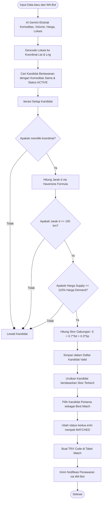

# Analisis Algoritma & Variabel Matching Engine - Ivolate

Dokumen ini menjelaskan rancangan algoritma, variabel, dan formula matematika yang digunakan untuk menghitung kecocokan (*matching*) antara penawaran pangan dari petani (*Supply*) dan permintaan dari pedagang (*Demand*) di dalam platform **Ivolate**.

Sistem Ivolate memiliki dua mekanisme pencocokan:
1. **Simple Auto-Matching** (Digunakan untuk input manual melalui API dashboard).
2. **Smart Matching Engine (SME)** (Digunakan untuk transaksi dinamis melalui bot WhatsApp).

---

## 1. Simple Auto-Matching (Dashboard Web)

Pencocokan ini berjalan secara searah ketika entri baru dibuat melalui formulir dashboard web. Mekanisme ini fokus pada kecocokan harga terbaik secara instan tanpa memperhitungkan faktor geografis.

### A. Input Permintaan Baru (Demand)
* **File Rujukan**: [src/app/api/demand/route.ts](file:///C:/LIST%20PROJECT/ivolate/ivolate-dashboard/src/app/api/demand/route.ts#L52-L65)
* **Kriteria Pencocokan**:
  1. Komoditas sama (*case-insensitive*).
  2. Status pasokan target adalah `ACTIVE`.
  3. Akun pembuat penawaran bukanlah pengguna yang sama (`userId` berbeda).
  4. Harga penawaran (*Supply Price*) harus **lebih kecil atau sama dengan ($\le$)** harga permintaan (*Demand Price*).
* **Prioritas Urutan**: Mengambil penawaran dengan **harga termurah** (`orderBy: { price: 'asc' }`).

### B. Input Penawaran Baru (Supply)
* **File Rujukan**: [src/app/api/supply/route.ts](file:///C:/LIST%20PROJECT/ivolate/ivolate-dashboard/src/app/api/supply/route.ts#L52-L65)
* **Kriteria Pencocokan**:
  1. Komoditas sama (*case-insensitive*).
  2. Status permintaan target adalah `ACTIVE`.
  3. Akun pembuat permintaan bukanlah pengguna yang sama (`userId` berbeda).
  4. Harga permintaan (*Demand Price*) harus **lebih besar atau sama dengan ($\ge$)** harga penawaran (*Supply Price*).
* **Prioritas Urutan**: Mengambil permintaan dengan **harga penawaran termahal** (`orderBy: { price: 'desc' }`).

---

## 2. Smart Matching Engine (SME)

Smart Matching Engine (SME) diimplementasikan pada file [src/app/api/webhook/wa/route.ts](file:///C:/LIST%20PROJECT/ivolate/ivolate-dashboard/src/app/api/webhook/wa/route.ts#L108-L217). Algoritma ini berjalan ketika data dimasukkan melalui WhatsApp bot dan dianalisis oleh AI Gemini. Algoritma ini menggunakan filter geolokasi dan perhitungan skor berbobot (*weighted score*).

### Variabel yang Digunakan
| Variabel | Tipe Data | Deskripsi | Sumber Data |
| :--- | :--- | :--- | :--- |
| `commodity` | String | Nama komoditas pangan (misal: "cabai merah") | Hasil ekstraksi pesan WA (Gemini AI) |
| `qty` | Float | Kuantitas volume komoditas (dalam kg) | Hasil ekstraksi pesan WA (Gemini AI) |
| `price` | Float | Harga per kg komoditas | Hasil ekstraksi pesan WA (Gemini AI) |
| `lat`, `lng` | Float | Koordinat lintang dan bujur lokasi | Hasil integrasi API Geocoding |
| `status` | Enum | Status ketersediaan data (`ACTIVE`, `MATCHED`, `CLOSED`) | Kolom status di database |
| `userId` | String | Identitas unik pengguna pengirim pesan | Diperoleh dari pencocokan nomor WA |

---

### Alur dan Perhitungan Matematika

#### Langkah 1: Pengambilan Kandidat
Sistem menyaring seluruh data di database yang memiliki tipe berlawanan (misal: jika entri baru adalah `SUPPLY`, maka dicarikan kandidat dari tipe `DEMAND`) yang berstatus `ACTIVE` untuk komoditas pangan yang sama.

#### Langkah 2: Penyaringan Jarak (Haversine Formula)
Untuk membatasi biaya distribusi logistik, dipasang batas toleransi jarak maksimum:
$$\text{Jarak Maksimum (MAX\_DISTANCE\_KM)} = 100\text{ km}$$

Jarak antara lokasi entri baru ($lat_1, lng_1$) dengan lokasi kandidat ($lat_2, lng_2$) dihitung menggunakan **Formula Haversine**:
$$d = 2R \cdot \arcsin\left(\sqrt{\sin^2\left(\frac{\Delta \text{lat}}{2}\right) + \cos(\text{lat}_1) \cdot \cos(\text{lat}_2) \cdot \sin^2\left(\frac{\Delta \text{lng}}{2}\right)}\right)$$

Di mana:
* $R$ = Jari-jari rata-rata bumi ($6371\text{ km}$).
* $\Delta \text{lat} = \text{lat}_2 - \text{lat}_1$ (dikonversi ke radian).
* $\Delta \text{lng} = \text{lng}_2 - \text{lng}_1$ (dikonversi ke radian).

> [!WARNING]
> Kandidat yang memiliki jarak $d > 100\text{ km}$ or tidak memiliki data koordinat valid akan langsung dilewati (*skipped*).

#### Langkah 3: Penyaringan Harga Premium (Price Tolerance)
Sistem menerapkan batas maksimum di mana harga pasokan (*supply*) tidak boleh melebihi $115\%$ dari batas harga pedagang (*demand*).
$$\text{Rasio Maksimum (MAX\_PRICE\_PREMIUM\_RATIO)} = 1.15$$

$$\text{Kondisi Valid}: \frac{\text{Harga Supply}}{\text{Harga Demand}} \le 1.15$$

Jika rasio harga melampaui $1.15$, maka kandidat dianggap terlalu mahal dan dieliminasi.

#### Langkah 4: Penghitungan Skor Kecocokan (Scoring)
Setiap kandidat yang lolos penyaringan jarak dan harga akan dihitung skornya. **Skor yang semakin rendah menunjukkan tingkat kecocokan yang semakin tinggi.**

Skor dihitung berdasarkan kombinasi linear dari dua faktor yang telah dinormalisasi:

1. **Normalisasi Jarak ($S_d$)**:
   $$S_d = \frac{d}{\text{MAX\_DISTANCE\_KM}} = \frac{d}{100}$$
   *(Bernilai antara $0.0$ s.d. $1.0$)*

2. **Normalisasi Harga ($S_p$)**:
   Mengukur seberapa jauh harga penawaran berada di atas harga permintaan pedagang (dalam rentang toleransi $15\%$ atau $0.15$):
   Jika $\text{Harga Demand} > 0$:
   $$S_p = \max\left(0, \frac{\frac{\text{Harga Supply}}{\text{Harga Demand}} - 1}{0.15}\right)$$
   *(Bernilai $0.0$ jika harga supply sama atau lebih murah dari demand, dan naik maksimal hingga $1.0$ jika berada di ambang batas atas toleransi)*

3. **Formulasi Skor Akhir ($S$)**:
   Menggabungkan kedua skor di atas dengan bobot kontribusi **70% Jarak** dan **30% Harga**:
   $$S = (0.7 \times S_d) + (0.3 \times S_p)$$

#### Langkah 5: Penentuan Pemenang
Seluruh kandidat diurutkan secara menaik (*ascending*) berdasarkan skor $S$. Kandidat dengan skor terkecil (terdekat secara spasial dan paling masuk akal secara finansial) dipilih sebagai pasangan transaksi.

---

## 3. Visualisasi Alur Smart Matching Engine

---

## 4. Perubahan Status Entri dan Match

Alur hidup transaksi setelah pencocokan diatur di dalam [src/lib/transactions.ts](file:///C:/LIST%20PROJECT/ivolate/ivolate-dashboard/src/lib/transactions.ts):

* **Tahap PENDING**: Entri dicocokkan, dibuatkan kode `TRX-XXXX`, status entri diganti ke `MATCHED` (agar disembunyikan dari daftar pasar umum/GIS), dan sistem mengirimkan penawaran ke pembeli.
* **Perintah `AMBIL TRX-XXXX`**: Pembeli menyetujui. Status transaksi `Match` berubah menjadi `MATCHED`. Sistem menukar kontak WhatsApp antara penjual dan pembeli agar mereka dapat bertransaksi langsung secara mandiri.
* **Perintah `SUKSES TRX-XXXX`**: Transaksi dinyatakan selesai. Status transaksi diubah menjadi `COMPLETED`, dan status produk diubah menjadi `CLOSED` (selesai secara permanen).
* **Perintah `BATAL TRX-XXXX`**: Transaksi dibatalkan. Status transaksi diubah menjadi `CANCELLED`, dan status kedua entri produk dikembalikan ke `ACTIVE` agar bisa dicocokkan ulang oleh Matching Engine dengan pengguna lain.
