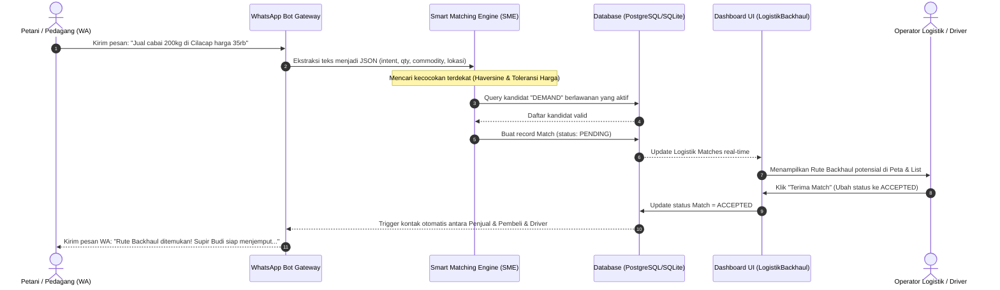

# Dokumentasi & Panduan Implementasi Logistik Backhaul (Truk Balikan) - Tumbasna

Dokumen ini menjelaskan secara rinci konsep **Logistik Backhaul (Truk Balikan)**, alur kerja sistem, arsitektur data, formula optimasi, serta panduan langkah-demi-langkah untuk mengimplementasikan dan mengintegrasikan fitur ini secara penuh ke dalam platform **Tumbasna**.

---

## 1. Pendahuluan & Konsep Bisnis

Dalam rantai pasok pangan tradisional di Indonesia, salah satu kontributor terbesar tingginya harga pangan di tingkat konsumen (inflasi) adalah **inefisiensi logistik**. 

### Masalah: "Deadheading" (Truk Kosong)
Ketika sebuah armada logistik mengirimkan komoditas pertanian dari daerah produsen (misal: Banyumas) ke daerah konsumen (misal: Cilacap), truk tersebut sering kali **kembali dalam keadaan kosong** (*deadheading*). Biaya bahan bakar dan operasional perjalanan pulang kosong ini tetap dibebankan pada pengiriman pertama, sehingga melipatgandakan biaya logistik per kilogram komoditas.

### Solusi: Logistik Backhaul (Truk Balikan)
**Logistik Backhaul** adalah optimalisasi rute perjalanan pulang armada pengiriman dengan cara mencocokkannya dengan pasokan (*Supply*) atau permintaan (*Demand*) pangan lain yang searah dengan rute pulang tersebut.

> [!NOTE]
> Dengan memanfaatkan **Truk Balikan**, biaya pengiriman dapat dipotong hingga **30% - 50%**, yang secara langsung menurunkan Harga Pokok Penjualan (HPP) komoditas di pasar tujuan dan meminimalkan disparitas harga antar wilayah.

---

## 2. Arsitektur Teknis & Skema Data

Sistem Logistik Backhaul diintegrasikan langsung dengan database melalui relasi model `Match` dan `ProductEntry` di dalam Prisma ORM.

### A. Skema Database (Prisma)
Rujukan file: [schema.prisma](file:///C:/LIST%20PROJECT/ivolate/tumbasna-dashboard/prisma/schema.prisma)

Di bawah ini adalah keterkaitan entitas di database yang mendukung pencatatan transaksi logistik backhaul:

```prisma
model ProductEntry {
  id              String    @id @default(uuid())
  userId          String
  type            String    // "SUPPLY" atau "DEMAND"
  commodity       String    // Nama komoditas (misal: "Cabai Merah")
  qty             Float     // Kuantitas dalam Kg
  price           Float     // Harga per Kg
  location        String    // Nama Lokasi (Text)
  lat             Float?    // Koordinat Lintang
  lng             Float?    // Koordinat Bujur
  status          String    @default("ACTIVE") // ACTIVE, MATCHED, CLOSED
  createdAt       DateTime  @default(now())
  updatedAt       DateTime  @updatedAt
  matchesAsDemand Match[]   @relation("DemandMatch")
  matchesAsSupply Match[]   @relation("SupplyMatch")
  user            User      @relation(fields: [userId], references: [id])
}

model Match {
  id            String       @id @default(uuid())
  code          String?      @unique // Kode transaksi unik, e.g., TRX-XXXX
  supplyEntryId String
  demandEntryId String
  status        String       @default("PENDING") // PENDING, ACCEPTED, REJECTED, COMPLETED
  notifiedAt    DateTime?
  createdAt     DateTime     @default(now())
  updatedAt     DateTime     @updatedAt
  demandEntry   ProductEntry @relation("DemandMatch", fields: [demandEntryId], references: [id])
  supplyEntry   ProductEntry @relation("SupplyMatch", fields: [supplyEntryId], references: [id])
}
```

---

## 3. Alur Kerja Logistik Backhaul

Integrasi proses logistik backhaul dimulai dari interaksi pengguna di WhatsApp hingga visualisasi dan eksekusi di dashboard monitoring.



---

## 4. Algoritma Optimasi Spasial & Finansial

Smart Matching Engine (SME) membatasi kandidat pencocokan backhaul dengan batasan logistik yang ketat untuk memastikan rute efisien:

### 1. Perhitungan Jarak (Formula Haversine)
Jarak maksimal antartitik pasokan dan permintaan dibatasi maksimal **100 KM** guna menekan konsumsi bahan bakar (*fuel burn*) akibat deviasi rute (*detour*).
$$d = 2R \cdot \arcsin\left(\sqrt{\sin^2\left(\frac{\Delta \text{lat}}{2}\right) + \cos(\text{lat}_1) \cdot \cos(\text{lat}_2) \cdot \sin^2\left(\frac{\Delta \text{lng}}{2}\right)}\right)$$
*Jika $d > 100 \text{ km}$, kandidat langsung dieliminasi.*

### 2. Toleransi Harga Premium (Price Tolerance)
Harga penawaran petani (*Supply*) tidak boleh melebihi **115%** dari anggaran pembeli (*Demand*).
$$\text{Rasio} = \frac{\text{Harga Supply}}{\text{Harga Demand}} \le 1.15$$

### 3. Formula Skor Gabungan (Weighted Scoring)
Kandidat diurutkan berdasarkan skor akhir ($S$). **Skor terkecil menunjukkan kecocokan terbaik.**
$$S = (0.7 \times S_d) + (0.3 \times S_p)$$
Di mana:
*   $S_d = \frac{d}{100}$ (Normalisasi Jarak $0$ s.d $1$)
*   $S_p = \max\left(0, \frac{\text{Rasio} - 1}{0.15}\right)$ (Normalisasi Harga $0$ s.d $1$)

---

## 5. Panduan Implementasi Komponen Dashboard

Komponen frontend visualisasi logistik backhaul telah disiapkan pada file [LogistikBackhaul.tsx](file:///C:/LIST%20PROJECT/ivolate/tumbasna-dashboard/src/components/LogistikBackhaul.tsx). Berikut adalah langkah-langkah untuk menghubungkan database ke komponen tersebut.

### Langkah 1: Buat API Route Backend untuk Data Backhaul
Buat file baru di `src/app/api/logistik/backhaul/route.ts` untuk mengambil data `Match` riil dari database PostgreSQL/SQLite dan merelasikannya dengan koordinat lokasi untuk menghitung jarak.

```typescript
// File: src/app/api/logistik/backhaul/route.ts
import { NextResponse } from 'next/server';
import { prisma } from '@/lib/prisma'; // Sesuaikan lokasi prisma client Anda

// Helper Formula Haversine
const calculateDistance = (lat1: number, lng1: number, lat2: number, lng2: number): number => {
  const R = 6371; // Jari-jari bumi (km)
  const toRad = (deg: number) => (deg * Math.PI) / 180;
  const dLat = toRad(lat2 - lat1);
  const dLng = toRad(lng2 - lng1);
  const a =
    Math.sin(dLat / 2) ** 2 +
    Math.cos(toRad(lat1)) * Math.cos(toRad(lat2)) * Math.sin(dLng / 2) ** 2;
  return R * 2 * Math.atan2(Math.sqrt(a), Math.sqrt(1 - a));
};

export async function GET() {
  try {
    // Ambil data match yang berelasi dengan supply dan demand
    const rawMatches = await prisma.match.findMany({
      include: {
        supplyEntry: {
          include: { user: true },
        },
        demandEntry: {
          include: { user: true },
        },
      },
      orderBy: { createdAt: 'desc' },
    });

    const formattedMatches = rawMatches.map((m) => {
      let distanceKm = null;
      if (
        m.supplyEntry.lat != null && m.supplyEntry.lng != null &&
        m.demandEntry.lat != null && m.demandEntry.lng != null
      ) {
        distanceKm = calculateDistance(
          m.supplyEntry.lat,
          m.supplyEntry.lng,
          m.demandEntry.lat,
          m.demandEntry.lng
        );
      }

      return {
        id: m.id,
        commodity: m.supplyEntry.commodity,
        supplyLocation: m.supplyEntry.location,
        demandLocation: m.demandEntry.location,
        supplyQty: m.supplyEntry.qty,
        demandQty: m.demandEntry.qty,
        supplyPrice: m.supplyEntry.price,
        demandPrice: m.demandEntry.price,
        distanceKm,
        status: m.status,
        matchedAt: m.createdAt.toISOString(),
        supplyPhone: m.supplyEntry.user.phoneNumber,
        demandPhone: m.demandEntry.user.phoneNumber,
      };
    });

    // Menghitung statistik ringkas
    const totalMatches = formattedMatches.length;
    const pendingMatches = formattedMatches.filter(m => m.status === 'PENDING').length;
    const acceptedMatches = formattedMatches.filter(m => m.status === 'ACCEPTED').length;
    const totalQtyMoved = formattedMatches
      .filter(m => m.status === 'ACCEPTED')
      .reduce((sum, m) => sum + m.supplyQty, 0);

    return NextResponse.json({
      matches: formattedMatches,
      stats: {
        totalMatches,
        pendingMatches,
        acceptedMatches,
        totalQtyMoved,
      },
    });
  } catch (error) {
    console.error('Failed to fetch backhaul data:', error);
    return NextResponse.json({ error: 'Internal Server Error' }, { status: 500 });
  }
}
```

---

### Langkah 2: Buat Halaman Route Dashboard untuk Backhaul
Buat halaman baru di `src/app/dashboard/logistik/backhaul/page.tsx` (atau integrasikan ke dalam halaman logistik utama) yang melakukan fetch data ke API di atas secara dinamis.

```typescript
// File: src/app/dashboard/logistik/backhaul/page.tsx
'use client';

import { useEffect, useState } from 'react';
import LogistikBackhaul, { BackhaulMatch } from '@/components/LogistikBackhaul';

type Stats = {
  totalMatches: number;
  pendingMatches: number;
  acceptedMatches: number;
  totalQtyMoved: number;
};

export default function BackhaulPage() {
  const [data, setData] = useState<{ matches: BackhaulMatch[]; stats: Stats } | null>(null);
  const [loading, setLoading] = useState(true);
  const [error, setError] = useState<string | null>(null);

  useEffect(() => {
    async function fetchData() {
      try {
        const res = await fetch('/api/logistik/backhaul');
        if (!res.ok) throw new Error('Gagal memuat data logistik backhaul.');
        const json = await res.json();
        setData(json);
      } catch (err: any) {
        setError(err.message || 'Terjadi kesalahan sistem.');
      } finally {
        setLoading(false);
      }
    }
    fetchData();
  }, []);

  if (loading) {
    return (
      <div className="flex h-screen items-center justify-center bg-[#F8FAFC]">
        <div className="text-center">
          <div className="h-10 w-10 animate-spin rounded-full border-4 border-blue-600 border-t-transparent mx-auto"></div>
          <p className="mt-4 text-sm font-bold text-slate-500">Memuat Rute Backhaul...</p>
        </div>
      </div>
    );
  }

  if (error) {
    return (
      <div className="flex h-screen items-center justify-center bg-[#F8FAFC]">
        <div className="text-center text-red-600 max-w-md px-6">
          <p className="text-lg font-bold">Error Terjadi</p>
          <p className="text-sm mt-2 text-slate-500">{error}</p>
        </div>
      </div>
    );
  }

  return (
    <LogistikBackhaul 
      matches={data?.matches || []} 
      stats={data?.stats || { totalMatches: 0, pendingMatches: 0, acceptedMatches: 0, totalQtyMoved: 0 }} 
    />
  );
}
```

---

### Langkah 3: Integrasikan Menu Navigasi Sidebar
Daftarkan halaman baru ini di dalam sidebar navigasi agar mudah diakses oleh administrator/operator logistik.
Rujukan file: [SidebarLayout.tsx](file:///C:/LIST%20PROJECT/ivolate/tumbasna-dashboard/src/components/SidebarLayout.tsx)

```diff
// Tambahkan item menu Backhaul di dalam menu logistik atau sebagai navigasi mandiri
const menuItems = [
  ...
  {
    title: 'Logistik',
    icon: Truck,
-   path: '/dashboard/logistik',
+   path: '/dashboard/logistik',
+   subItems: [
+     { title: 'Armada & Rute', path: '/dashboard/logistik' },
+     { title: 'Truk Balikan (Backhaul)', path: '/dashboard/logistik/backhaul' }
+   ]
  },
  ...
];
```

---

## 6. Dampak Penggunaan Truk Balikan (Backhaul)

Penerapan Backhaul terbukti memberikan keuntungan berlipat pada ekosistem **Tumbasna**:

1.  **Bagi Petani (Suppliers)**: Menjamin kepastian jemputan komoditas di daerah pelosok karena armada logistik mendapat insentif finansial tambahan pada jalur perjalanan pulang mereka.
2.  **Bagi Pedagang (Demand)**: Memangkas biaya ongkir (*shipping cost*) hingga **35%**, sehingga komoditas dapat dijual dengan harga yang lebih terjangkau.
3.  **Bagi Transporter/Supir Truk**: Meningkatkan utilitas armada logistik mendekati **95%** (tidak ada kilometer yang sia-sia tanpa muatan) serta meningkatkan pendapatan bersih supir.
4.  **Bagi Pemerintah / Ketahanan Pangan**: Menjadi instrumen intervensi pasar yang efektif untuk meredakan gejolak harga pangan akibat kelangkaan stok lokal.
