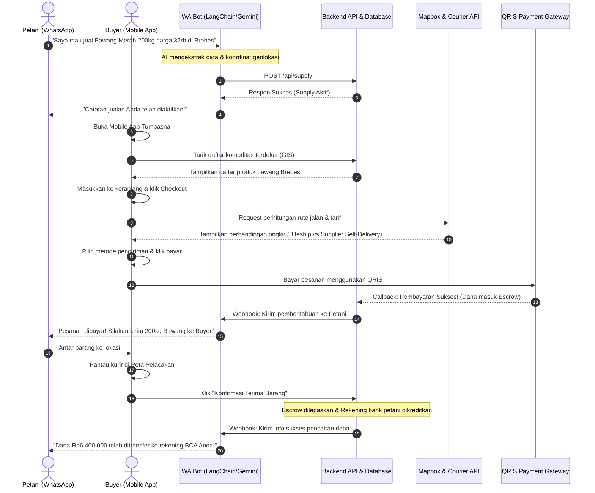

# User Journey & Alur Kerja Sistem Tumbasna

Dokumen ini menjelaskan alur perjalanan pengguna (*User Journey*) di dalam platform **Tumbasna**, sebuah ekosistem pangan hibrida yang mengintegrasikan **WhatsApp Bot** (untuk kemudahan Petani/Supplier) dan **Mobile App** (untuk fleksibilitas Buyer/UMKM).

---

## 📌 Gambaran Umum Ekosistem Tumbasna

Tumbasna menjembatani rantai pasok dari petani langsung ke pedagang/UMKM tanpa perantara tengkulak. 
Untuk mengakomodasi perbedaan literasi teknologi, Tumbasna menggunakan dua antarmuka berbeda:
1. **WhatsApp Bot (`tumbasna-whatsapp`)**: Ditujukan untuk **Petani / Supplier** agar dapat mendaftar dan menjual hasil panen dengan ketikan pesan teks biasa (bahasa alami).
2. **Mobile App (`tumbasna-mobile`)**: Ditujukan untuk **Buyer / UMKM** untuk menelusuri pasar komoditas secara visual, melakukan checkout, memilih opsi pengiriman terbaik, dan membayar secara instan melalui QRIS.

```
       PETANI                                                  BUYER / UMKM
  (WhatsApp Bot UI)                                          (Mobile App UI)
         │                                                          │
         ▼                                                          ▼
  Natural Chat Msg                                           Browsing Pasar
  "Jual Cabai 50kg..."                                       & Cari Komoditas
         │                                                          │
         ▼                                                          ▼
   AI Parsing (LLM)  ───► [DATABASE / API] ◄──────────────────────  Checkout
         │                                                          │
         ▼                                                          ▼
  Matching Engine    ◄───  (Match Auto)    ──────────────────────  Bayar QRIS
         │                                                          │
         ▼                                                          ▼
  WA Notifications   ◄───  Status Update   ──────────────────────  Real-time Map
```

---

## 🧑‍🌾 1. User Journey: Petani / Supplier (WhatsApp Bot)

Petani tidak perlu mengunduh aplikasi berat. Semua interaksi dilakukan melalui chat WhatsApp interaktif yang dikendalikan oleh AI Agent (Gemini/LangChain).

### A. Pendaftaran & Onboarding
1. Petani memulai percakapan dengan mengirim pesan apa pun ke nomor WhatsApp Bot Tumbasna.
2. WhatsApp Bot mendeteksi nomor telepon baru yang belum terdaftar di database.
3. Bot meminta petani menyebutkan nama dan lokasi umum pertanian/gudang mereka.
4. Data disimpan di database, dan petani siap untuk mulai berjualan.

### B. Unggah Komoditas (Pesan Natural)
1. Petani mengetik pesan penawaran secara bebas, misalnya:
   > *"Saya panen bawang merah Brebes super ada sekitar 2 kuintal, mau dijual harga 32.000 per kilo. Posisi barang di Brebes dekat Alun-alun."*
2. AI Agent secara otomatis melakukan ekstraksi informasi mentah tersebut menjadi format JSON:
   * **Komoditas**: Bawang Merah Brebes
   * **Volume**: 200 Kg (konversi otomatis dari kuintal)
   * **Harga**: Rp32.000 / Kg
   * **Lokasi**: Alun-alun Brebes (dilakukan Geocoding koordinat Lat/Lng secara otomatis)
3. Jika data sudah lengkap, status diatur menjadi `COMPLETE` dan dimasukkan ke tabel `Supply` lewat REST API.
4. Bot membalas dengan konfirmasi ramah: *"Penawaran Bawang Merah Brebes Anda sebesar 200 kg dengan harga Rp32.000/kg telah aktif di pasar Tumbasna. Kami akan mengabari Anda begitu ada pembeli yang cocok!"*

### C. Pemantauan Status & Saldo Mandiri (*Pull Mode*)
Petani dapat memeriksa status jualan dan saldo kapan saja melalui perintah chat:
* **Melihat Daftar Jualan**: Petani mengetik *"lihat daftar"* atau *"status jualan"*. Bot akan membalas dengan daftar penawaran aktif beserta statusnya (`Active`, `Matched`, atau `Selesai`).
* **Memeriksa Saldo Dompet**: Petani mengetik *"cek saldo"* atau *"dompet"*. Bot membalas dengan saldo yang dapat ditarik (*Available Balance*) dan saldo yang sedang ditahan di rekening penampung (*Escrow Balance*).
* **Penarikan Uang (Payout)**: Petani mengetik *"tarik dana"* atau *"cairkan saldo"*. Sistem memverifikasi saldo tersedia dan meneruskan permintaan transfer ke admin bank untuk diproses dalam 1x24 jam.

---

## 🏢 2. User Journey: Buyer / UMKM (Mobile App)

Buyer (pemilik restoran, katering, UMKM makanan) menggunakan Mobile App berbasis React/Ionic untuk kenyamanan berbelanja skala besar secara visual.

### A. Pendaftaran Akun Buyer
1. Buyer membuka aplikasi dan masuk ke halaman **Registrasi**.
2. Mengisi informasi akun: Nama Pemilik, Nama Bisnis (UMKM), Nomor WhatsApp Aktif, Alamat Pengiriman, Jenis Usaha (misal: Restoran, Katering), serta Rekening Bank (untuk pengembalian dana jika batal).
3. Setelah terdaftar, mereka dapat langsung mengakses dasbor pasar.

### B. Browsing & Pemilihan Komoditas
1. Buyer membuka tab **Pasar** di aplikasi.
2. Di halaman ini, buyer dapat melihat semua pasokan bahan pangan segar yang diunggah oleh petani.
3. Produk dapat difilter berdasarkan kategori (Bawang, Cabai, Beras, dll.) atau diurutkan berdasarkan jarak terdekat dan harga termurah.
4. Buyer melihat detail produk (deskripsi, rating petani, lokasi, serta grafik riwayat harga pasar) dan memasukkannya ke **Keranjang**.

### C. Checkout & Opsi Logistik
1. Di halaman **Checkout**, alamat pengiriman buyer dan alamat gudang supplier akan digunakan untuk menghitung biaya pengiriman secara dinamis.
2. Sistem menampilkan **Dual-Option Shipping**:
   * **Kurir Komersial (Biteship API)**: Layanan instan/reguler dari ekspedisi komersial (GrabExpress, GoSend, JNE, Sicepat).
   * **Supplier Self-Delivery (Rute Jalan Mapbox/OSRM)**: Petani mengirimkan sendiri barang tersebut menggunakan armada pribadinya dengan tarif berbasis jarak jalan sebenarnya.
3. Aplikasi menampilkan label **"Rekomendasi Cerdas"** pada pilihan kurir yang menawarkan harga termurah atau estimasi waktu tercepat.

### D. Pembayaran QRIS & Escrow
1. Buyer menekan tombol **"Bayar Sekarang"** dan diarahkan ke layar pembayaran QRIS dinamis.
2. Buyer memindai kode QRIS dan membayar menggunakan e-wallet atau m-banking mereka.
3. Setelah pembayaran sukses, dana **tidak langsung dikirim ke petani**, melainkan disimpan dengan aman di rekening penampung (**Tumbasna Escrow System**) untuk melindungi buyer dari penipuan.
4. Status pesanan berubah menjadi `Diproses`.

### E. Pelacakan Real-Time & Konfirmasi
1. Kurir (atau petani yang melakukan pengantaran mandiri) memulai rute perjalanan.
2. Buyer dapat memantau posisi pengiriman secara real-time langsung di peta aplikasi (rute mengikuti jalur jalan riil peta Indonesia).
3. Setelah barang sampai dan dicek kualitasnya oleh buyer, buyer menekan tombol **"Konfirmasi Terima Barang"** di aplikasi.
4. Sistem melepaskan dana dari Escrow dan mengirimkannya langsung ke saldo rekening bank petani.

---

## 🤖 3. Mesin Pencocokan: Smart Matching Engine (SME)

Tumbasna juga menyediakan fitur pencocokan otomatis di balik layar ketika ada kecocokan spasial dan finansial antara kebutuhan buyer dan pasokan petani.

1. **Input Kebutuhan (Demand)**: Buyer juga dapat memasukkan permintaan lewat WA Bot (misal: *"Saya butuh Cabai Rawit 50 kg harga di bawah 48rb"*).
2. **Perhitungan Skor SME**: Setiap kali ada `Supply` atau `Demand` baru masuk, sistem menghitung kecocokan menggunakan formula:
   * **Jarak Maksimum**: Dibatasi maksimal **100 Km** (menggunakan rumus Haversine). Jarak yang melebihi batas ini langsung dieliminasi dari pencocokan.
   * **Toleransi Harga**: Harga penawaran maksimal adalah **115%** dari harga permintaan buyer.
   * **Weighted Scoring**: Skor akhir dihitung dengan bobot **70% Jarak** dan **30% Harga**.
     $$Skor = (0.7 \times Skor\_Jarak) + (0.3 \times Skor\_Harga)$$
3. **Match Notification**: Sistem memilih pasangan dengan skor kecocokan terbaik (terkecil), mengunci status menjadi `MATCHED`, dan secara otomatis menembak webhook WhatsApp Bot untuk mengirimkan notifikasi ke petani dan buyer agar mereka bisa bertransaksi.

---

## 🔄 4. Siklus Transaksi Lengkap (Sequence Diagram)

Berikut adalah siklus alur kerja dari pendaftaran barang hingga pencairan dana:


